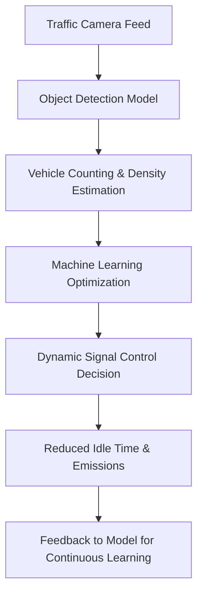

# 🚦 AI-Powered Smart Traffic Flow Optimization System  

### 🌱 Overview  
This project uses **Artificial Intelligence (AI)**, **Machine Learning (ML)**, and **Object Detection** to analyze live traffic footage and automatically optimize traffic signal timings.  
The system aims to **reduce vehicle idling**, **save fuel**, and **minimize carbon emissions**, contributing to **eco-friendly and sustainable urban mobility**.  

---

### 💡 Key Idea  
Traditional traffic lights follow fixed timers that often ignore real-time conditions.  
Our AI-powered system detects vehicle density at intersections using **object detection**, then optimizes signal timings dynamically to improve flow efficiency and reduce environmental impact.  

---

### ⚙️ Approach
1. **Traffic Video Input**  
   - The system accepts real-time or recorded traffic footage.  

2. **Object Detection**  
   - A deep learning model (e.g., YOLOv8, MobileNet-SSD) identifies and counts vehicles.  

3. **Traffic Density Estimation**  
   - ML algorithms process the count data to determine congestion levels.  

4. **Signal Optimization**  
   - The system adjusts green light durations dynamically based on current density.  

5. **Feedback Loop**  
   - The model continuously learns from new data to improve future predictions.  

---

### 🧠 System Flow (Diagram)


---

### 💻 Tech Stack  
| Category | Technologies Used |
|-----------|-------------------|
| **Programming Language** | Python 3.8+ |
| **AI / ML Frameworks** | PyTorch, Ultralytics |
| **Object Detection Models** | YOLOv8 (Nano/Small/Medium/Large) |
| **Computer Vision** | OpenCV, NumPy |
| **Data Handling** | Pandas, NumPy |
| **Visualization & Analysis** | Matplotlib, Seaborn |
| **Backend (optional)** | Flask / FastAPI for live feed processing |
| **Deployment (optional)** | Docker / ONNX Export |

---

### 📁 Folder Structure
```
AI-Smart-Traffic/
│
├── data/                    # Traffic images or video samples (for training)
├── src/                     # Core Python scripts
│   ├── main.py              # Main system - run this!
│   ├── yolo_detector.py     # YOLOv8 vehicle detection
│   ├── optimize.py          # ML-based signal optimization
│   ├── analytics.py         # Data analysis and visualization
│   ├── train_custom.py      # Custom model training
│   ├── detect.py            # Basic OpenCV detection (demo)
│   └── demo.py              # Simple demo script
│
├── results/                 # Output visuals, analysis graphs
├── requirements.txt         # Dependencies
├── README.md                # Project documentation
├── SETUP.md                 # Detailed setup instructions
└── optimization_history.json # Generated optimization logs
```

---

### 🌍 Impact & Benefits
✅ **Fuel Efficiency:** Less idling → reduced fuel consumption.  
✅ **Lower Emissions:** Helps reduce CO₂ output and air pollution.  
✅ **Smart Urban Mobility:** Supports future smart city ecosystems.  
✅ **Fully Software-Based:** Deployable using existing infrastructure.  

---

### 🎯 Current Features (Implemented)
✅ **Real-time YOLOv8 vehicle detection** with 4 vehicle classes  
✅ **Dynamic signal optimization** based on traffic density  
✅ **Fuel and CO₂ savings estimation** for each cycle  
✅ **Multi-model support** (nano to xlarge)  
✅ **Video and webcam processing** with live visualization  
✅ **Analytics dashboard** with charts and statistics  
✅ **Custom model training** pipeline  
✅ **Optimization history logging** for analysis  

---

### 🚀 Quick Start

```bash
# Install dependencies
pip install -r requirements.txt

# Run with webcam
cd src
python main.py --source webcam

# Run with video file
python main.py --source traffic_video.mp4 --output result.mp4

# Generate analytics
python analytics.py
```

See [SETUP.md](SETUP.md) for detailed instructions.

---

### 🚀 Future Enhancements  
- Weather-aware and time-of-day adaptive optimization  
- Integration with **emergency vehicle priority routing**  
- Real-time **web dashboard for traffic visualization**  
- Support for **multi-intersection synchronization**  
- Mobile app integration  
- Cloud deployment with API endpoints  

---

### ✍️ Research Scope  
This project has significant potential for research in areas like:  
- Sustainable AI for smart cities  
- Green computing in intelligent transportation systems  
- Multi-agent learning for traffic network optimization  
- CO₂ emission modeling using real-time vehicle data  
- Edge computing for traffic management  
