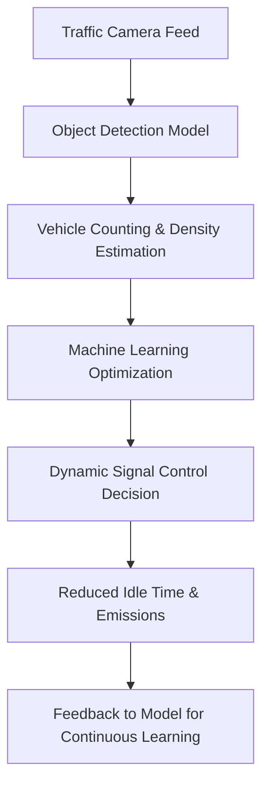

# 🚦 AI-Powered Smart Traffic Flow Optimization System  

### 🌱 Overview  
This project uses **Artificial Intelligence (AI)**, **Machine Learning (ML)**, and **Object Detection** to analyze live traffic footage and automatically optimize traffic signal timings.  
The system aims to **reduce vehicle idling**, **save fuel**, and **minimize carbon emissions**, contributing to **eco-friendly and sustainable urban mobility**.  

---

### 💡 Key Idea  
Traditional traffic lights follow fixed timers that often ignore real-time conditions.  
Our AI-powered system detects vehicle density at intersections using **object detection**, then optimizes signal timings dynamically to improve flow efficiency and reduce environmental impact.  

---

### ⚙️ Approach
1. **Traffic Video Input**  
   - The system accepts real-time or recorded traffic footage.  

2. **Object Detection**  
   - A deep learning model (e.g., YOLOv8, MobileNet-SSD) identifies and counts vehicles.  

3. **Traffic Density Estimation**  
   - ML algorithms process the count data to determine congestion levels.  

4. **Signal Optimization**  
   - The system adjusts green light durations dynamically based on current density.  

5. **Feedback Loop**  
   - The model continuously learns from new data to improve future predictions.  

---

### 🧠 System Flow (Diagram)


---

### 💻 Tech Stack  
| Category | Technologies Used |
|-----------|-------------------|
| **Programming Language** | Python |
| **AI / ML Frameworks** | TensorFlow / PyTorch |
| **Object Detection Models** | YOLOv8, MobileNet, OpenCV |
| **Data Handling** | NumPy, Pandas |
| **Visualization & Analysis** | Matplotlib, Seaborn |
| **Backend (optional)** | Flask / FastAPI for live feed processing |
| **Deployment (optional)** | Docker / Streamlit Dashboard |

---

### 📁 Folder Structure
```
AI-Smart-Traffic/
│
├── data/                    # Traffic images or video samples
├── models/                  # Pre-trained or trained detection models
├── notebooks/               # Jupyter notebooks for experimentation
├── src/                     # Core Python scripts
│   ├── detect.py            # Vehicle detection and counting
│   ├── optimize.py          # ML-based signal optimization
│   ├── main.py              # Main program file
│   └── utils.py             # Helper functions
│
├── results/                 # Output visuals, analysis graphs
├── requirements.txt         # Dependencies
└── README.md                # Project documentation
```

---

### 🌍 Impact & Benefits
✅ **Fuel Efficiency:** Less idling → reduced fuel consumption.  
✅ **Lower Emissions:** Helps reduce CO₂ output and air pollution.  
✅ **Smart Urban Mobility:** Supports future smart city ecosystems.  
✅ **Fully Software-Based:** Deployable using existing infrastructure.  

---

### 🚀 Future Enhancements  
- Weather-aware and time-of-day adaptive optimization.  
- Integration with **emergency vehicle priority routing**.  
- Real-time **dashboard for traffic visualization**.  
- Support for **multi-intersection synchronization**.  

---

### ✍️ Research Scope  
This project has significant potential for research in areas like:  
- Sustainable AI for smart cities.  
- Green computing in intelligent transportation systems.  
- Multi-agent learning for traffic network optimization.  
- CO₂ emission modeling using real-time vehicle data.  
